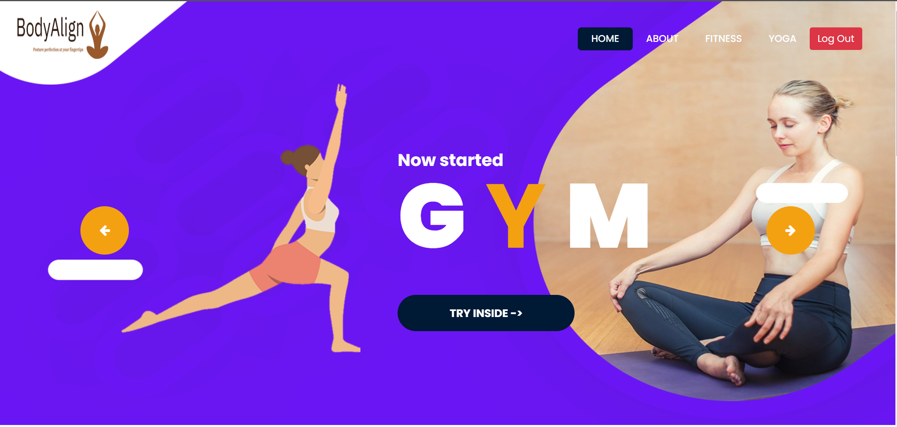
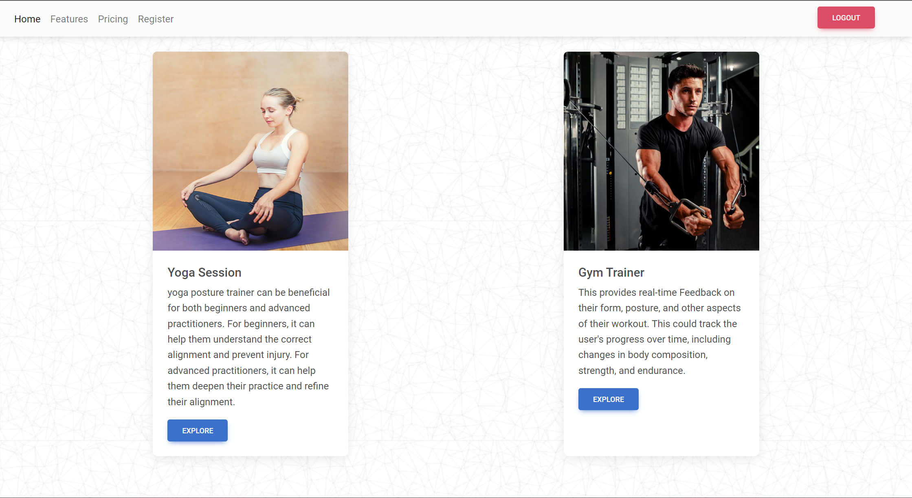
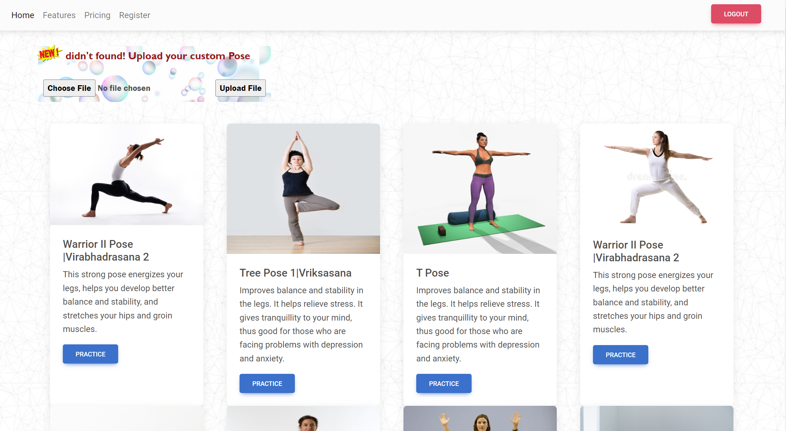
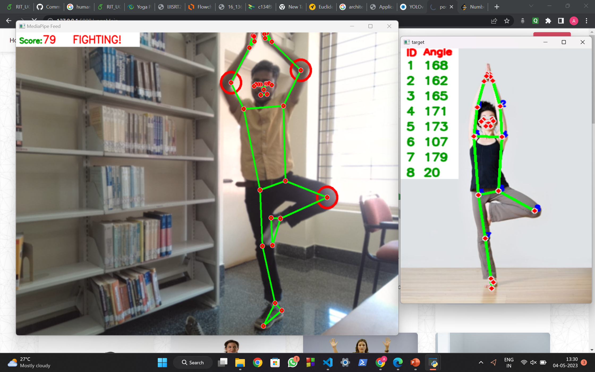
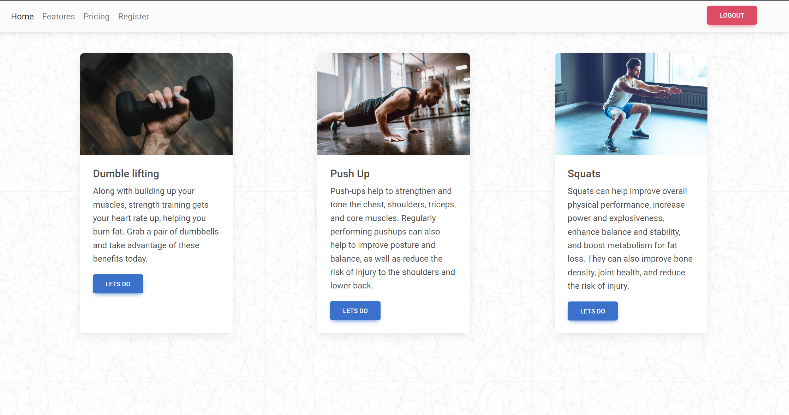
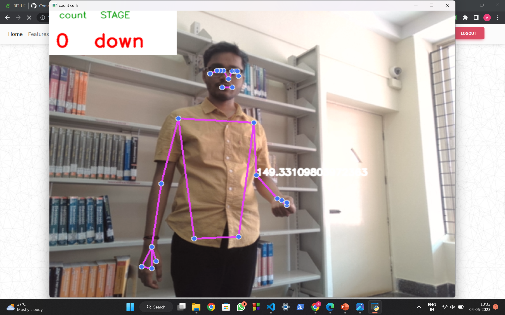
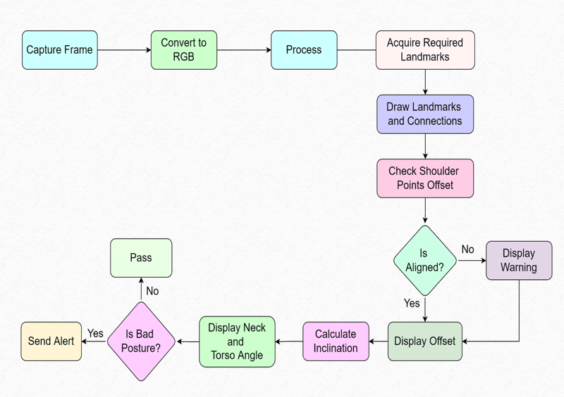
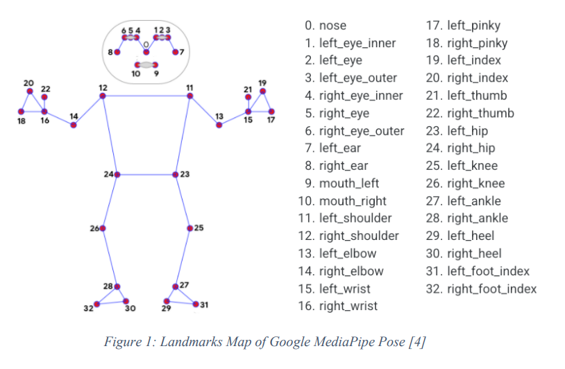

<!-- do Pull the code and 'npm install' and you are good to go. -->

# BodyAlign - AI Yoga and Fitness Tool

## Description

The purpose of human posture estimation is to accurately estimate the position and
orientation of a person’s body in space. This information can be used to monitor and
analyze body movements, identify incorrect body postures, and provide feedback for correction. The project proposed an
efficient way to practice yoga and do gym exercises properly without the presence of any
physical trainer. Here landmark points are being extracted and used to rectify the posture
performed by any person in front of the camera. This project also talks about Personal AI
gym trainer which comprises of dumble lifting, pushups and squats. This will track your
body movement in gym and displays count of it.

## Technology Used

- MediaPipe
- OpenCV
- Python
- HTML, CSS (Frontend)
- Flask (Backend)
- SQLAlchemy (database)

## Features

- Detect Yoga Instances.
- Suggests correction in Pose.
- Give real time Feedback.
- Upload your custom Pose.
- Personal AI Trainer.
- Keep count of biceps curls, Squats and Pushups.
- Login/Signup.

## Home Page



## Features



## Yoga Estimator



## Tree Pose



## Personal AI Gym Trainer



## Biceps Curls



## System Architecture



## MediaPipe



- Install dependencies and run the Server on

```
   python app.py
```
